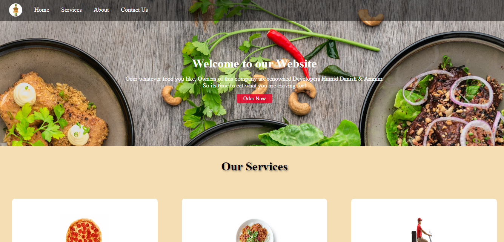

# Food Delivery Web - A Static Website for Food Delivery Services

This repository contains a static website project for a food delivery service. The website showcases various sections, including a navigation bar, services section, clients section, and a contact form.

## Preview



## Features

- **Navigation Bar:** Provides navigation links to different sections of the website.
- **Services Section:** Highlights the services offered by the food delivery business, including food ordering, catering, and bulk ordering.
- **Clients Section:** Displays logos of prominent clients who use the food delivery service.
- **Contact Form:** Allows users to submit their contact information and additional messages through a form.

## How to Use

1. Clone the repository using the following command:
   ```sh
   git clone https://github.com/MuhammadAmmarAtique/FoodDeliveryWeb
   ```

2. Open the `index.html` file in your web browser to view the Food Delivery Web project.

**Contributing:**
If you have any ideas to enhance the website or encounter any issues, feel free to open a pull request or an issue.

**License:**
This project is open-source and licensed under the MIT License.

**Disclaimer:**
The website content is fictional and is intended for demonstration purposes only.

**Feel free to modify and customize the project to further develop your HTML and CSS skills!**
